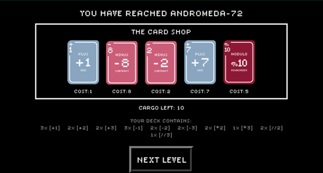

# Your days are numbered

_Your Days Are Numbered_ is a single-player roguelike cardgame. It is intended to familiarize players with the basic Python operators as well as to train their math skills.

## How to Run

The entire folder must be downloaded. Open your IDE, and use it to run the GUI.py file.

## Premise

Set in the distant future, players take the role of an intergalactic cabbage merchant, travelling between planets to sell the cargo in his spaceship. Your spaceship is powered by Fuel Cards, obtained by selling your cabbages at each planetary stop. Go quickly - your cabbages don't last forever! Get to each planet before your cabbages rot, or worse: you run out of fuel, and are stranded in space

## Rules 
Gameplay consists of two alternating phases:

1.	Play Phase

During the Play Phase, players use the cards in their deck to control the ship’s current heading. Each card contains one of the six basic Python operators (addition, subtraction, multiplication, integer division, exponent, modulo) and an integer number, forming a mathematical function. The objective is to use the functions on these cards to achieve the target heading (that is, the planet of destination – represented by a randomly generated number).

During each turn, the player:  
•	Draws 5 cards from their deck.  
•	May click on any one card to play it. The card is permanently used up for the rest of the Play Phase, and not returned to the deck.  
•	May play up to all 5 cards they have drawn, in any order.  
•	May proceed to the next turn by clicking the “Next Turn” button on the upper right-hand corner.  
•	May concede by clicking the “Concede” button on the lower right-hand corner.  

The number of cards remaining in the deck is displayed on the lower left-hand corner of the screen. The player may play until they have run out of cards. 1 cargo is also depleted per turn (the cabbages rot over time), though players may continue with turns even after they have run out of cargo.

If the player uses up all their cards without managing to reach the target heading, they lose the game. If the player reaches the target heading, they proceed to the Buy Phase.

2.	Buy Phase

During the Buy Phase, players have arrived at the destination planet to sell their cabbages.

During this phase, the player may choose from five cards to buy. The cost of each card (in units of cargo) is displayed below each card. The player may buy as few or as many cards as they like, until they run out of cargo. Players must strategize carefully to manage their limited resources, choosing carefully which cards would be most useful to add to their deck.

When the player is satisfied, they may click the “Next Level” button to proceed. The player gains an additional ten units of cargo, and the Play Phase of the next level begins.

## Graphical User Interface
### Main Menu

### Game Screen

### Shop Screen

### End Screen

## Technologies

Python 3.9.1.

## Credits
The font used in the GUI is Lo-Res, designed by Zuzana Licko from Emigre.
The .png images used for the cards and game logo were made by [xdaniel-lim](https://github.com/xdaniel-lim), and are his original creation.
