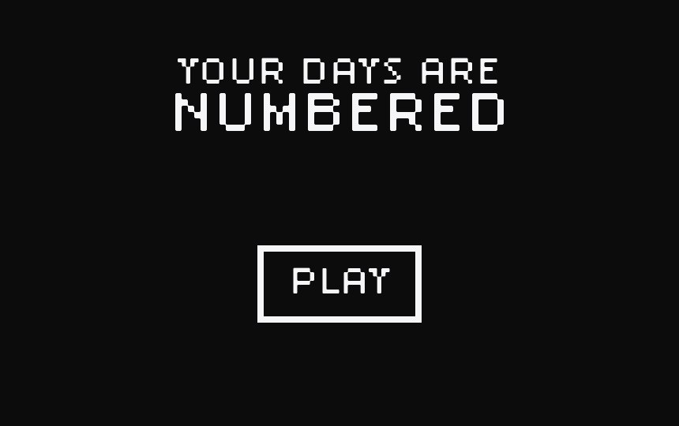
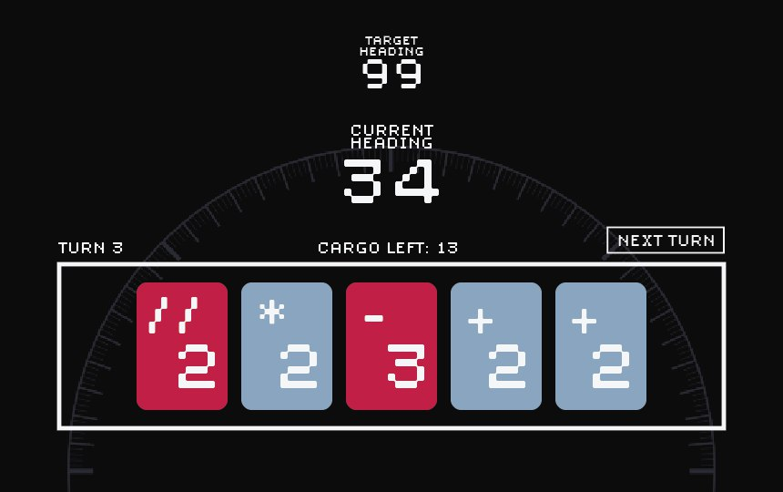
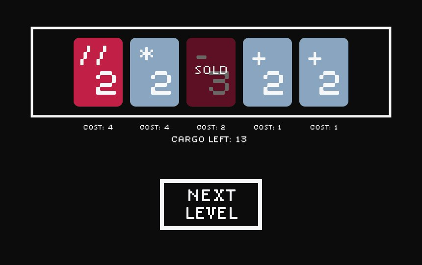

# Your days are numbered
Your days are numbered is a game for new programmers to learn about the basic python operators.

## Rules 
Play phase:
- You are given cargo and a given number
- Play cards to achieve that number 
- Cards contain basic python math operations. 
- Each turn you draw until you get <5> cards.
- End of turn: put remaining cards at the bottom of the deck 
- Lose: you lose when you run out of cards, not cargo.

Buy phase (in between levels):
- Remaining cargo gets added to next level cargo 
- Use remaining cargo to buy different cards. 
- Choose next level (choose cargo and target number as a pair)

## Gameplay
## Graphical User Interface
### Main Menu

### Game Screen

### Shop Screen

## How to run
This game does not use additional packages. Just download and run.

## Developers
Jean, Daniel, Ee Song, Saif, Siew Hean, Kaelen

tip u can press control + shift + v to preview md files